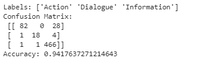

# Corporate Messages Classification

In this project, we aim at automating the Machine Learning workflow using an NLP pipeline that is applied to the corporate messages dataset.

It is one of the free datasets that can be found on the Figure Eight platform <a href = "https://appen.com/resources/datasets/" >here.</a>

Our main goal is to classify the text message.

## Data

Each row contains information about a social media post from different corporations and contains a column for the category of the post.

Posts' categories are classified as Information, Action, Dialogue, or Exclude.

	• Information: objective statements about the company or its activities.
	
	• Dialogue: replies to users for example
	
	• Action: messages that ask for votes or ask users to click on links.
	
	• Exclude: any category other than the mentioned ones
	
## Main Steps

	1- Cleaning and Tokenizing
	
	2- Building a Pipeline
	
	3- Feature Engineering
	
	4- Modeling with grid search

## Output

Accuracy is not a good indicator of the model performance in a classification problem. The information class was the dominant one, so, I used a simple confusion matrix to check the result.

